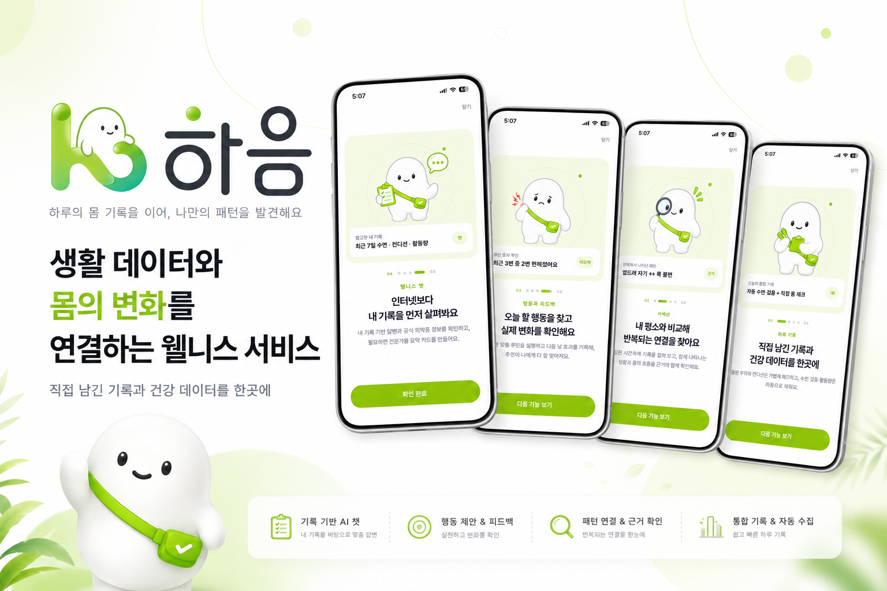
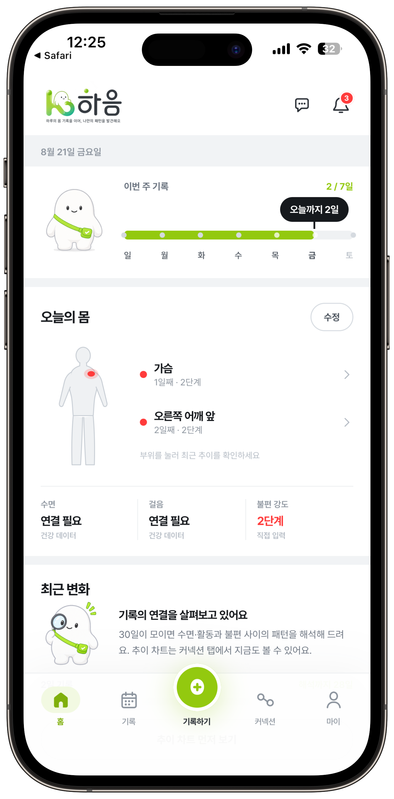
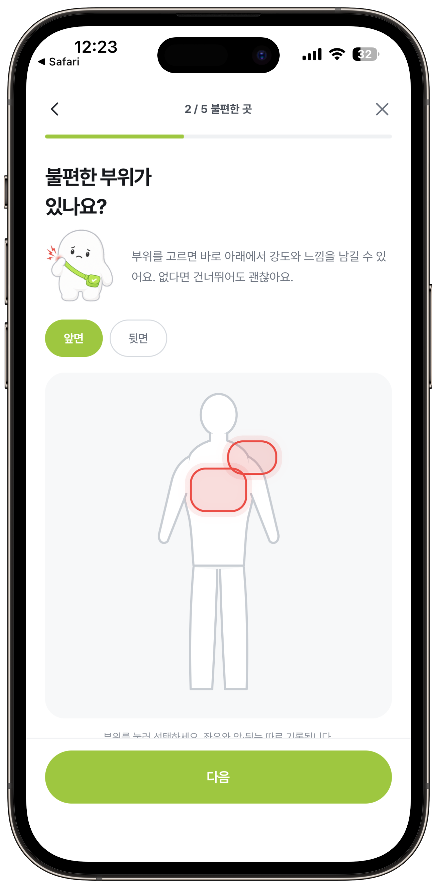
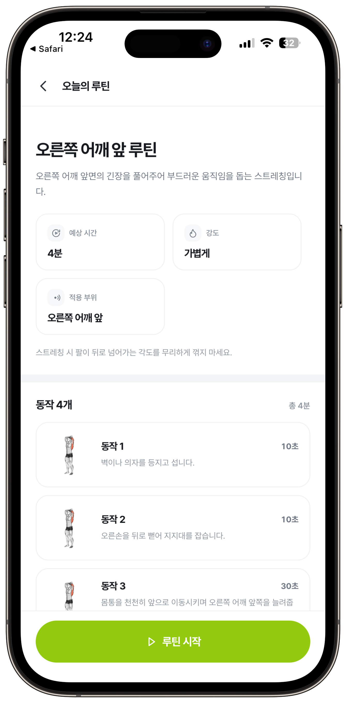
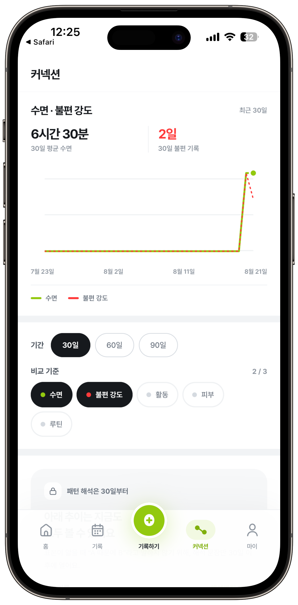
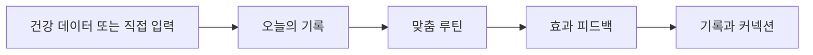
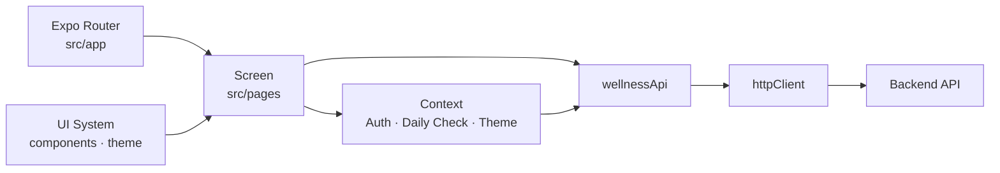

<h1 align="center">하음</h1>

<p align="center">
  <strong>하루</strong> + <strong>이음</strong><br />
  <sub>하루의 몸 기록을 이어, 나만의 패턴을 발견해요</sub>
</p>

<p align="center">
  
  
  
</p>

---

<p align="center">
  
</p>

하음은 수면·걸음 등 건강 데이터와 직접 입력한 컨디션, 불편 부위, 수면 습관을 하나의 흐름으로 기록합니다. 기록을 쌓는 데서 멈추지 않고, 오늘의 루틴·변화 패턴·상태 요약으로 다음 행동을 돕습니다.

> 하음은 의료 진단·치료·처방을 제공하지 않는 웰니스 서비스입니다. 증상이 지속되거나 심해지면 의료 전문가의 도움을 우선하세요.

## 핵심 기능

| 기능 | 설명 |
| --- | --- |
| **통합 기록** | Apple 건강 데이터와 직접 입력한 컨디션·불편 부위·수면 정보를 한곳에 기록합니다. |
| **맞춤 루틴** | 오늘의 상태에 맞춘 짧은 스트레칭을 실행하고, 이후 효과를 확인합니다. |
| **커넥션** | 누적된 기록을 바탕으로 생활 데이터와 몸 상태의 반복되는 변화를 살펴봅니다. |
| **기록 기반 도구** | 웰니스 챗과 상태 요약 카드로 내 기록을 다시 확인하고 정리합니다. |

## 화면 미리보기

| 홈 | 오늘의 기록 | 맞춤 루틴 | 커넥션 |
| :---: | :---: | :---: | :---: |
|  |  |  |  |

## 사용자 흐름



<p align="center"><sub>건강 데이터 연동은 선택 사항이며, 연결하지 않아도 직접 기록을 이어갈 수 있습니다.</sub></p>

## 프론트엔드 아키텍처



| 영역 | 구성 |
| --- | --- |
| **라우팅** | Expo Router의 파일 기반 라우팅을 사용하며, 인증·온보딩 상태에 따라 진입 경로를 제어합니다. |
| **상태 관리** | 인증 세션, 데일리 체크 초안, 테마, 알림 상태를 Context 단위로 분리합니다. |
| **UI 시스템** | 공통 컴포넌트와 색상·간격·타이포그래피 토큰으로 화면 간 일관성을 유지합니다. |
| **데이터 계층** | 화면은 `wellnessApi`를 사용하고, API 요청·토큰·에러 처리는 `httpClient`에 모읍니다. |

## 기술 스택

**App**


**Navigation & native integrations**


## 시작하기

### 요구 사항

| 항목 | 버전·설명 |
| --- | --- |
| Node.js | `24.15.0` (`.nvmrc` 기준) |
| 패키지 매니저 | npm |
| iOS 건강 데이터 | macOS 및 Apple 개발 환경 필요 |

### 설치

```bash
nvm use
npm ci
```

### 환경 변수

`.env.example`을 복사해 `.env` 파일을 만든 후, 백엔드 API 주소를 입력합니다.

```powershell
Copy-Item .env.example .env
```

```env
EXPO_PUBLIC_API_BASE_URL=https://api.example.com
EXPO_PUBLIC_ENABLE_AUTH_MOCK=false

# Android Firebase 설정이 필요한 빌드에서만 사용
GOOGLE_SERVICES_JSON=/absolute/path/to/google-services.json
```

`EXPO_PUBLIC_API_BASE_URL`은 필수입니다. 인증 정보나 개인 키는 `.env`에 넣지 말고 EAS 환경 변수로 관리하세요.

### 실행

```bash
npm start          # 개발 서버 시작
npm run android    # Android
npm run ios        # iOS
npm run web        # Web
npm run lint       # 코드 검사
```

## 프로젝트 구조

```text
src/
├─ app/           # Expo Router 경로와 레이아웃
├─ pages/         # 화면 단위 UI와 화면별 데이터 가공
├─ components/    # 재사용 UI, 차트, 아이콘
├─ context/       # 인증·테마·알림·데일리 체크 전역 상태
├─ services/      # API, 인증 저장소, 건강 데이터 동기화
├─ domain/        # 앱 내부 도메인 모델
├─ theme/         # 색상 토큰, 타이포그래피, 팔레트
├─ config/        # 런타임 환경 설정
└─ utils/         # 날짜 등 공통 유틸리티
assets/           # 폰트, 로고, 캐릭터, 앱 아이콘
```

인증 토큰은 Secure Store에 저장하며, API 요청 시 `Authorization: Bearer <token>` 헤더로 자동 전송합니다. 백엔드 계약을 변경할 때는 `src/types/api.ts`, `src/services/backend/`, `src/domain/wellness.ts`를 함께 확인하세요.

## 빌드

EAS Build 프로필은 `development`, `preview`, `production`으로 구성되어 있습니다.

```bash
# Android 프리뷰 빌드 예시
npx eas build --profile preview --platform android
```

배포용 환경 변수와 인증서는 EAS 프로젝트 환경 변수에서 설정합니다. `google-services.json`, 인증서, 개인 키는 저장소에 커밋하지 않습니다.

## 기여하기

1. 새 작업 브랜치를 만듭니다.
2. 화면은 `src/pages`, 라우트 연결은 `src/app`에 추가합니다.
3. 색상·간격·글꼴은 `src/theme` 토큰을 우선 사용합니다.
4. PR 전 `npm run lint`를 실행합니다.

## 라이선스

이 프로젝트는 [MIT License](LICENSE)를 따릅니다.
